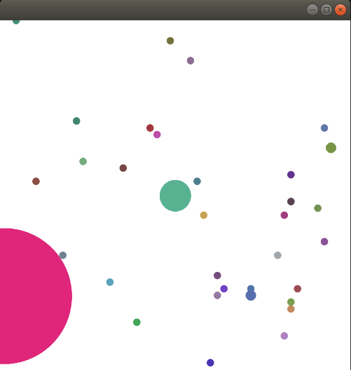

Gym env that replicates agar.io



# How to install:
cd to this repo. Then run:
```
pip install -e .
```

Or simply:
```
pip install aigar
```

# How to use:
Simply import aigar and import gym.
The following easy environments are available:
  1. "AigarPellet-v0" - You control a single cell. The goal is to collect as many pellets as quickly as possible.
  2. "AigarGreedy1-v0" - You control a single cell. There is another cell controlled by a simple greedy heuristic. Collect as many pellets as quickly as possible and eat the opponent as often as you can.

There are many more options available by following the naming scheme: "Aigar[Pellet|Greedy[1|2|5]][Grid][Split][Eject]-v0"
The number behind "Greedy" determines the number of greedy bots. If "Grid" is used a simplified lower dimensional observation space will be used (not based on pixels). If "Split" is used the player cell can split itself, just as in agar.io. If "Eject" is used the player cell can eject some mass, just as in agar.io.

# Observation Space:  
By default, the observation space will be an rgb image of size (900, 900, 3). 

If the "Grid" option is used an easier version of the obs space will be used, e.g. in "AigarPelletGrid-v0". In this easier version the obs space is either (11, 11, 3) in the "Pellet" options or (11, 11, 4) in the "Greedy" options. The first two dimensions determine the size of the grid and the last dimension the number of grids. The first grid determines the pellet mass per grid cell, the second grid is the combined mass of every cell of the player that is at least partially in a grid cell and the third grid determine the playing field boundary, every grid receives a floating value between 0 and 1 depending on how much of it is outside of the playing field. The additional grid in the Greedy version determines the combined mass of every opponent cell (no matter which opponent) that is at least partially in that grid cell. One cell of the player or opponent can thus count for multiple cells.

# Action Space:
The action space in this version consists out of two dimensions: the x and y location of the cursor. It is limited to a range of 0-1, mapping the whole possible space of possitions of the cursor.

If the "Split" option is used, the action space increases by one. The additional continuous action determines the split action: a value above 0.5 means the player cells will split, otherwise not.

The "Eject" option has the same effect as the "Split" option, but for ejecting. This option is not selectable if "Split" is not selected, e.g. there is not "AigarPelletEject-v0", only an "AigarPelletSplitEject-v0".
  

